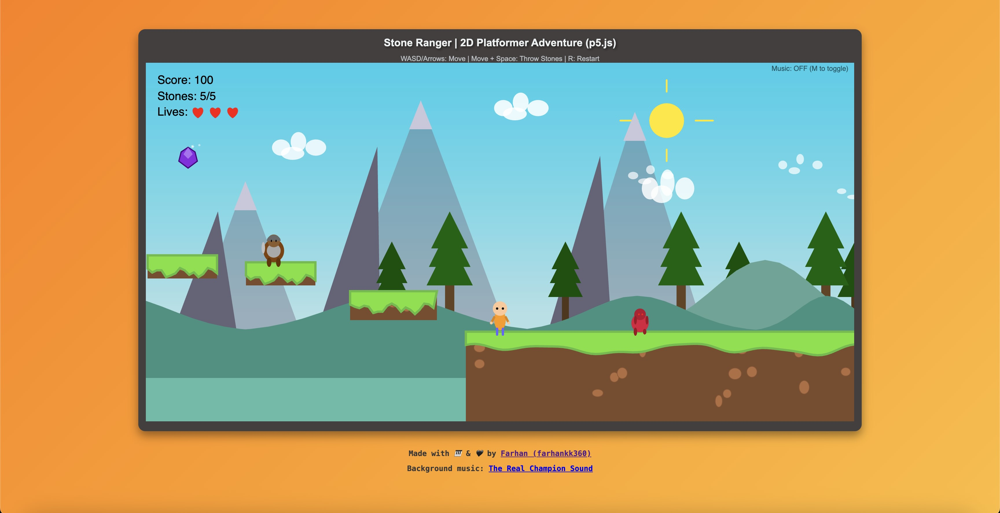

# 🎮 Stone Ranger

## 2D Platformer Adventure Game

**Stone Ranger** is an exciting browser-based 2D platformer built with p5.js, featuring dynamic gameplay, immersive sound effects, and challenging level design.

### See it in action

https://farhankk360.github.io/stone-ranger

### 🌟 Features

- **🏃 Smooth Platformer Movement** - Responsive WASD/Arrow key controls with fluid animations
- **⚔️ Strategic Combat** - Defeat enemies by throwing stones with realistic physics
- **🎯 Collectible System** - Gather coins, gems, and power-ups for points and extra lives
- **🎵 Dynamic Audio** - Immersive background music and satisfying sound effects
- **🚀 Moving Platforms** - Navigate challenging vertical and horizontal moving platforms
- **🏁 Victory Conditions** - Reach the flagpole to complete the level
- **💫 Start Screen** - Professional overlay interface with game preview
- **🏆 Scoring System**

### 🎯 Gameplay

**Objective:** Navigate through the challenging platformer world, collect items, defeat enemies, and reach the flagpole to win!

**Controls:**

- **WASD** or **Arrow Keys** - Move left/right, jump
- **Space** - Throw stones (while moving)
- **M** - Toggle background music
- **R** - Restart level

**Game Mechanics:**

- Collect **coins** and **gems** for points
- Gather **power-ups** for bonus points and extra lives
- Defeat **3 types of enemies**: Walkers, Jumpers, and Guards
- Use **stone projectiles** strategically - they bounce off enemies and can be recollected
- Navigate **moving platforms** for advanced challenges

### 🎨 Technical Features

- **Modular Architecture** - Clean separation of game components
- **Advanced Physics** - Realistic gravity, collision detection, and projectile mechanics
- **Dynamic Camera** - Smooth camera following with proper bounds
- **State Management** - Professional game state handling (start screen, playing, game over, level complete)
- **Audio Integration** - p5.sound.js for comprehensive audio experience
- **Responsive Design** - Optimized for modern browsers

### 🛠️ Technology Stack

- **p5.js** - Main game framework
- **p5.sound.js** - Audio processing and management
- **HTML5 Canvas** - Graphics rendering
- **JavaScript ES6+** - Modern JavaScript features
- **Modular Components** - Organized file structure

### 🎵 Audio Credits

- **Background Music**: [The Real Champion Sound](https://www.youtube.com/watch?v=Bmhb-YCEUMQ) by Farhan (farhankk360)
- **Sound Effects**: Custom-designed for optimal game experience from [OpenGameArt.org](https://opengameart.org/content/library-of-game-sounds)
- **Atmospheric Audio**: Wind ambience for immersion from [OpenGameArt.org](https://opengameart.org/content/library-of-game-sounds)

This project is part of the University of London CM1005 - Introduction to Programming I coursework.
